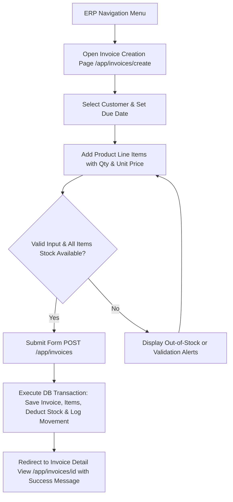
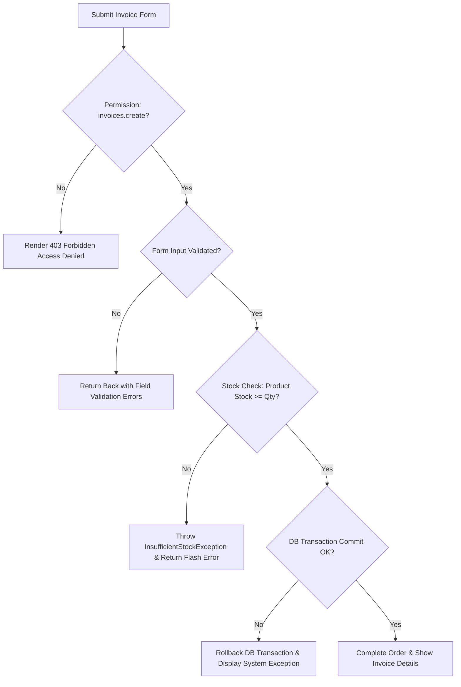
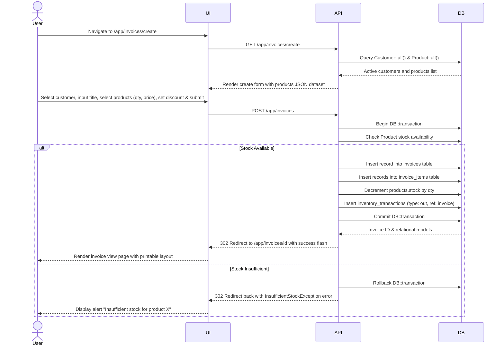
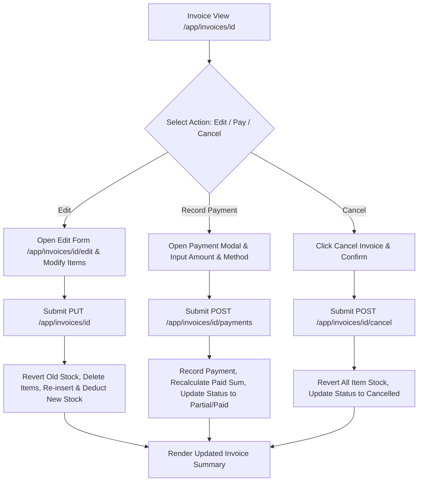
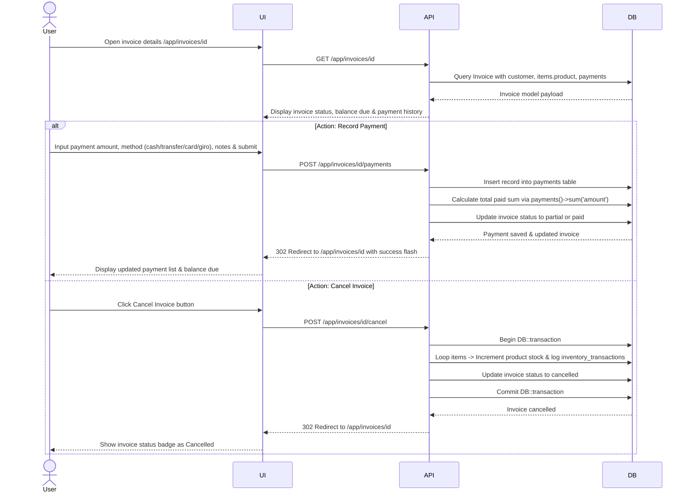
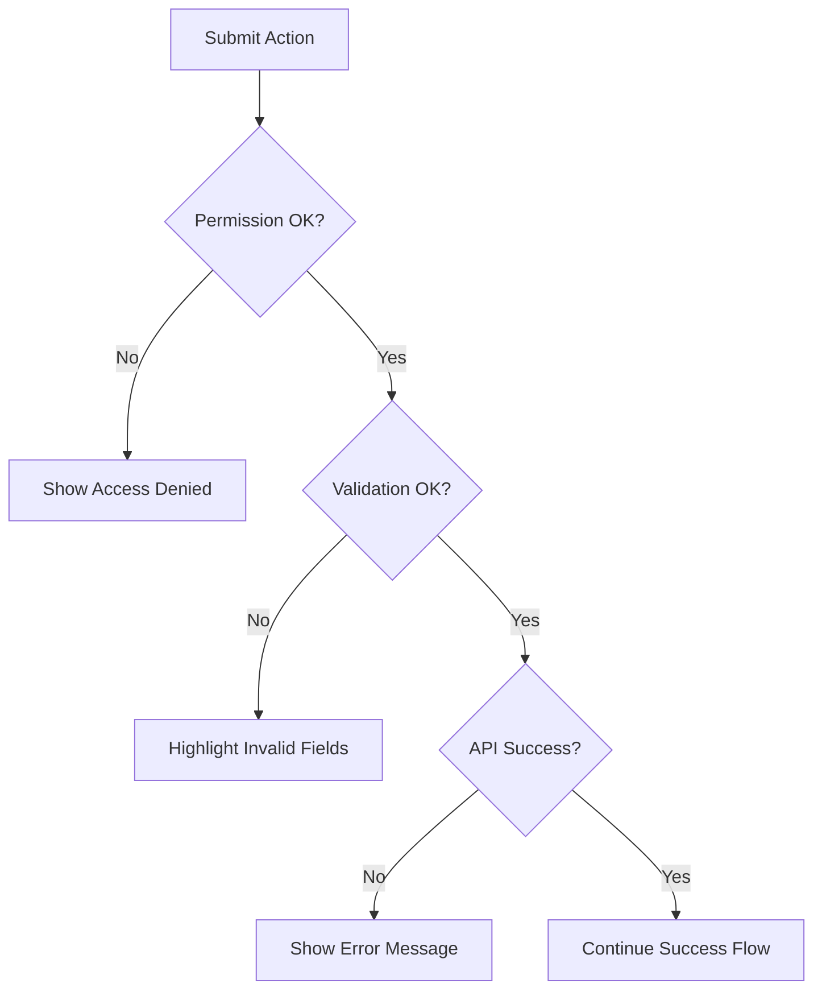
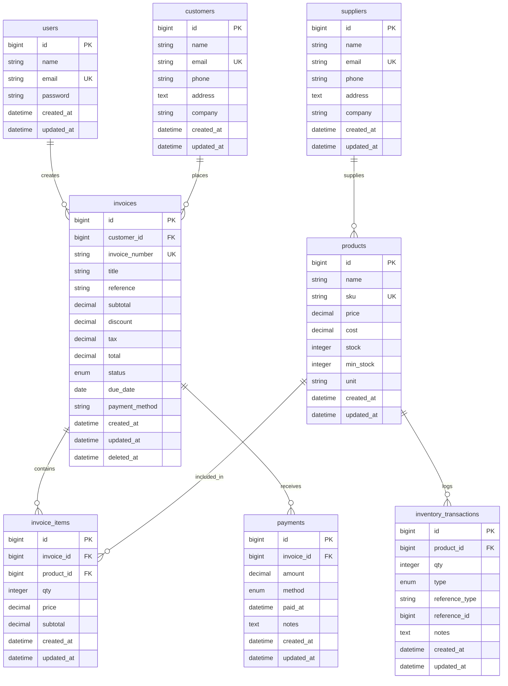

# Docs Specification - Minimal ERP Sales, Inventory & Master Data System

The Minimal ERP Sales, Inventory & Master Data System provides small businesses with streamlined sales invoicing, multi-item order processing, automated stock deduction, payment recording, and inventory auditing capabilities. Built on Laravel 12 with Blade, Alpine.js, and Livewire, it integrates customer relationship records, supplier management, and product catalog controls into a clean transactional workflow. The system enforces strict database transactions (`DB::transaction`) during invoice commits to guarantee data integrity between billing subtotals and physical stock ledgers. Scope includes invoice drafting, customer linking, line-item pricing (with 11% PPN tax calculations and discount subtotals), inventory stock adjustments, payment ledger entries, and status transitions.

**Version:** 0.1.0  
**Owner:** Rizqy  
**Last Updated:** 2026-07-27

## Invoice & Sales Management - Create

### Objectives

- Create multi-item sales invoices with automatic subtotal, discount, tax (11%), and grand total calculations in under 15 seconds.
- Maintain 100% real-time stock integrity by executing atomic database transactions that decrement product stock and append `inventory_transactions` audit records upon invoice creation.

### Assumptions and Constraints

- Active user session with authenticated role containing `invoices.create` permission.
- Selected customer must exist in `customers` table and selected products must have `stock >= required qty`.
- Tax calculation defaults to 11% (`Config::get('app.tax_rate', 11)`) applied to `(subtotal - discount)`.

### Actors and Permissions

| Actor/Role | Permissions |
| --- | --- |
| Admin / Manager | `invoices.create`, `invoices.view`, `invoices.edit`, `invoices.delete`, `invoices.cancel`, `payments.create`, `inventory.adjust` |
| Sales Staff | `invoices.create`, `invoices.view`, `customers.view`, `products.view`, `payments.create` |
| Inventory Staff | `inventory.view`, `inventory.adjust`, `products.view`, `products.edit` |

### User Flow (Main)

Purpose: Primary user journey from entry to completion, focused on the happy path and key decisions.

### Error and Validation Flow

Purpose: Validation, permission, and system error paths, including user feedback and recovery behavior.

### Sequence Diagram - Create

Purpose: UI to API interactions for the create flow, including lookup calls and record insertion.

### Acceptance Criteria

1. Authenticated user with `invoices.create` permission can create an invoice with single or multiple line items.
2. Attempting to select a product with quantity exceeding available stock aborts creation and displays a clear error message.
3. Successful creation calculates `subtotal`, `tax` (11%), and `total`, decrements product stock, logs inventory movement (`type: out`), and sets invoice status to `pending` (or `draft`).

## Invoice & Sales Management - Update

### Objectives

- Support editing of existing invoices, adjusting item quantities, applying payments, or executing invoice cancellations.
- Automatically revert previous stock deductions, recalculate totals, apply new stock subtractions, and maintain transaction logs during edits.

### Assumptions and Constraints

- Invoices with status `paid` or `cancelled` cannot have their line items edited directly; payments or cancellation must follow dedicated routes.
- Invoice update operations execute inside atomic `DB::transaction` blocks.

### Actors and Permissions

| Actor/Role | Permissions |
| --- | --- |
| Admin / Manager | `invoices.edit`, `invoices.cancel`, `payments.create` |
| Sales Staff | `invoices.edit` (draft/pending invoices only), `payments.create` |

### User Flow (Main)

### Sequence Diagram - Update

Purpose: UI to API interactions for update flow, including permission checks and side effects.

### Acceptance Criteria

1. Users can record full or partial payments (`cash`, `transfer`, `card`, `giro`), automatically updating invoice status to `partial` or `paid`.
2. Cancelling an invoice reverts product stock levels, logs inventory transactions (`type: in`), and updates invoice status to `cancelled`.
3. Updating an invoice recalculates subtotals, taxes, and discounts while maintaining accurate stock levels via transaction rollback/re-deduction.

## Shared Diagrams and References

### Error and Validation Flow

Purpose: Validation, permission, and system error paths, including user feedback and recovery behavior.

### Data Model (ERD)

Purpose: Tables, relations, and key constraints required by this feature.

### API Contract Reference

| No | File | Description |
| --- | --- | --- |
| 1 | [contract-api/feature-openapi.yaml](contract-api/feature-openapi.yaml) | OpenAPI spec for ERP routes, request validations, models, and error responses. |

### Mock Data Reference

| No | File | Description |
| --- | --- | --- |
| 1 | [mockoon/feature-mock.json](mockoon/feature-mock.json) | Mock endpoints and sample JSON payloads for ERP invoices, products, and payments. |

### State or Status Lifecycle (Optional)

Invoices follow the state transition lifecycle: `draft` -> `pending` -> `partial` -> `paid` (or `overdue`/`cancelled`). Invoices with `due_date` prior to current date without full payment transition to `overdue`.

### Edge Cases

- **Race Condition on Stock**: Two concurrent requests attempting to purchase the last available item stock trigger `InsufficientStockException` on the second transaction and safely rollback.
- **Partial Payments**: Multiple small payments logged until cumulative sum equals or exceeds `invoices.total`, transitioning status from `partial` to `paid`.
- **Invoice Cancellation**: Cancelling an invoice with logged payments preserves payment audit records while restoring inventory stock via `type: in` transaction logs.

### Observability

- **Inventory Audit Trail**: Every stock change is permanently logged in `inventory_transactions` with `reference_type` (`invoice`, `invoice_update`, `invoice_cancel`, `manual_adjust`) and `reference_id`.
- **Performance Indexes**: Indexes applied on `invoices.status`, `invoices.customer_id`, `invoices.invoice_number`, `invoice_items.invoice_id`, `payments.invoice_id`, and `inventory_transactions.product_id`.
- **Exception Logging**: `InsufficientStockException` logged with product ID, requested quantity, and available stock metrics.

## Change Log

| Date | Author | Change |
| --- | --- | --- |
| 2026-07-27 | Rizqy | Fixed Mermaid syntax syntax errors (double quotes around nodes with slashes/braces, non-nested sequence diagram alt blocks, clean ERD enums). |
